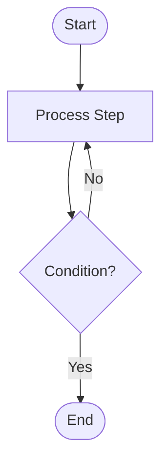

# Pseudocode Common Rules - All Languages

## Naming Conventions

- **Variables**: camelCase (`inputCount`, `customerName`)
- **Types/Structures**: PascalCase (`CustomerRecord`, `OrderDetail`)
- **Constants**: UPPER_SNAKE_CASE (`MAX_RECORDS`, `TAX_RATE`)
- **Functions/Procedures**: PascalCase with verb (`ProcessRecord`, `CalculateTotal`)

## Data Types

- `INTEGER` - whole numbers
- `DECIMAL(n,m)` - financial precision (n digits, m decimals)
- `STRING[n]` - text (max n characters)
- `BOOLEAN` - true/false
- `DATE` / `DATETIME` - dates/times
- `ARRAY[n] OF TYPE` - arrays
- `STRUCTURE` - composite types

## Pseudocode Syntax

### Structure Definition
```
STRUCTURE StructureName:
    field: TYPE[length]    // Description
END STRUCTURE
```

### Constants
```
CONSTANTS:
    NAME = value
END CONSTANTS
```

### Functions/Procedures
```
FUNCTION Name(param: TYPE) RETURNS TYPE
BEGIN
    RETURN value
END FUNCTION

PROCEDURE Name(param: TYPE)
BEGIN
    statements
END PROCEDURE
```

### Control Flow
```
IF condition THEN ... ELSE ... END IF
WHILE condition DO ... END WHILE
FOR i FROM start TO end BY step DO ... END FOR
SWITCH expr: CASE val: ... BREAK; DEFAULT: ... END SWITCH
```

### File Operations
```
file = OPEN(path) FOR READING|WRITING|APPENDING
record = READ_RECORD(file)
WRITE_RECORD(file, record)
CLOSE(file)
IF END_OF_FILE(file) THEN ...
```

### Error Handling
```
TRY:
    statements
CATCH ExceptionType:
    handler
FINALLY:
    cleanup
END TRY
```

## Financial Precision Rule

**CRITICAL**: Always use `DECIMAL(n,m)` for money. Never use floating point.
```
amount: DECIMAL(15,2)
result = ROUND(calculation, 2)  // Use HALF_UP rounding
```

## Mermaid Flowchart Template
````

````

## Document Structure Template
```
# [PROGRAM-NAME] - Description

## Program Overview
- Purpose, Input, Output, Original Source

## Data Structures
[Structures and constants]

## Main Algorithm
[High-level flow]

## Core Processing Logic
[Detailed procedures]

## Flowchart (Mermaid)
[Diagram]

## Decision Logic / Special Cases / Error Handling
[Business rules and edge cases]

## Example Traces / Testing / Integration Points
[Walkthroughs and dependencies]
```
