# Mermaid Diagrams for Specification

This document provides guidance on creating Mermaid diagrams from pseudocode analysis to visualize system structure and behavior.

## When to Use Diagrams

**Use diagrams to clarify:**
- Complex workflows with multiple paths
- Entity relationships and data models
- System interactions and integrations
- State transitions and lifecycle
- Component architecture and dependencies

**Don't overuse:**
- Simple linear processes (plain text is clearer)
- When pseudocode is self-explanatory
- For audiences unfamiliar with diagrams

## Diagram Types and Use Cases

### 1. Sequence Diagram

**Use for:** Interaction flows, API calls, message passing

**When to extract from pseudocode:**
```
functionA calls functionB
functionB queries database
database returns results
functionB calls externalAPI
externalAPI responds
functionB returns to functionA
```

**Mermaid Notation:**
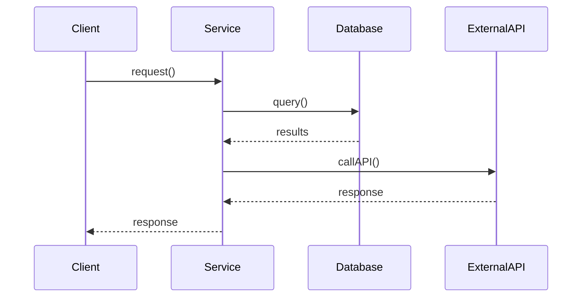

**Markdown Format:**
````markdown
## Sequence Diagram: [Process Name]

```mermaid
sequenceDiagram
    participant Actor
    participant System
    participant Database
    participant ExternalAPI
    
    Actor->>System: Action
    System->>Database: Query
    Database-->>System: Results
    System->>ExternalAPI: Request
    ExternalAPI-->>System: Response
    System-->>Actor: Final Response
```
````

**Key Elements:**
- Participants: Systems, actors, components (declared with `participant`)
- Messages: Synchronous (`->>`) or asynchronous (`-->>`)
- Return messages: Dashed arrows (`-->>`) 
- Activations: Shown automatically or with `activate`/`deactivate`

### 2. Activity Diagram (Flowchart)

**Use for:** Business processes, algorithm flow, decision logic

**When to extract from pseudocode:**
```
if condition1:
  action1()
  if condition2:
    action2()
  else:
    action3()
else:
  action4()
```

**Mermaid Flowchart:**
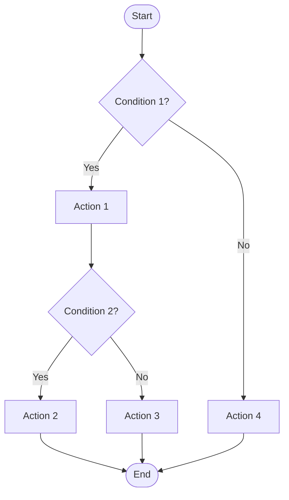

**Markdown Format:**
````markdown
## Activity Diagram: [Process Name]

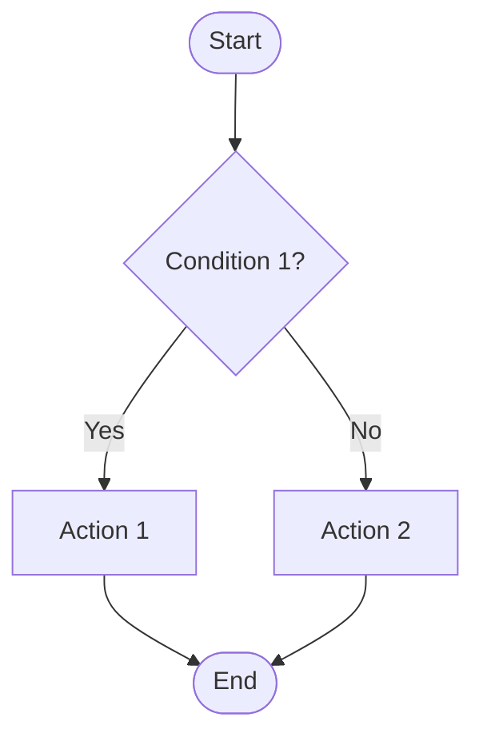
````

**Key Elements:**
- Start/End nodes: `([Start])`, `([End])`
- Activities: `[Action]`
- Decisions: `{Condition?}` with labeled edges
- Flow direction: `TD` (top-down), `LR` (left-right)
- Parallel flows: Use subgraphs or multiple paths

### 3. State Machine Diagram

**Use for:** Entity lifecycle, status transitions, mode changes

**When to extract from pseudocode:**
```
if state == "pending":
  if approved:
    state = "active"
  if rejected:
    state = "cancelled"
else if state == "active":
  if suspend:
    state = "suspended"
```

**Mermaid State Diagram:**
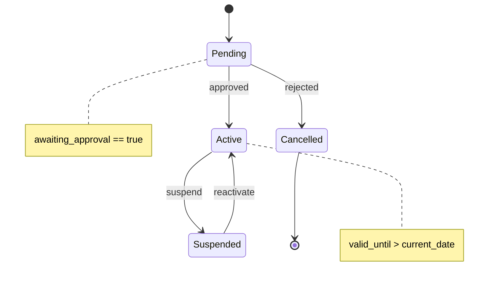

**Markdown Format:**
````markdown
## State Machine: [Entity Name]

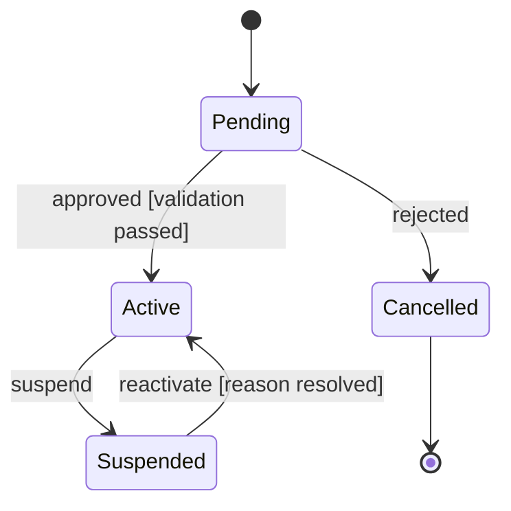

**States:**
- Pending: Initial state after creation
- Active: Normal operational state
- Suspended: Temporarily disabled
- Cancelled: Terminal state (cannot transition out)

**Transitions:**
- Pending → Active: Event = approved, Guard = validation passed
- Pending → Cancelled: Event = rejected
- Active → Suspended: Event = suspend
- Suspended → Active: Event = reactivate, Guard = reason resolved

**State Invariants:**
- Pending: awaiting_approval == true
- Active: valid_until > current_date
- Suspended: suspension_reason must be set
````

**Key Elements:**
- Initial state: `[*]`
- Final state: `[*]` at end of transition
- States: Named automatically from transitions
- Transitions: `State1 --> State2: event [guard]`
- Notes: `note right of State` for annotations

### 4. Class Diagram (Data Model)

**Use for:** Entity relationships, data structures, object hierarchies

**When to extract from pseudocode:**
```
class Order:
  id, customer, items, total
  
class OrderItem:
  product, quantity, price

class Customer:
  id, name, email
```

**Mermaid Class Diagram:**
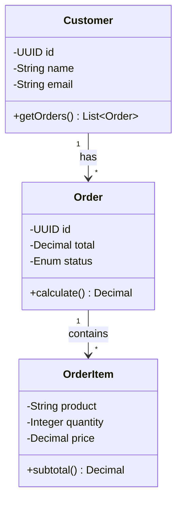

**Markdown Format:**
````markdown
## Class Diagram: [Domain Name]

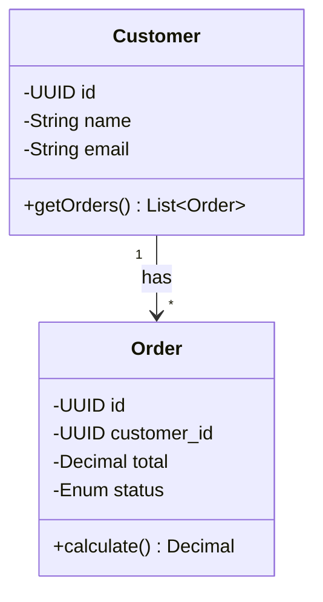

### Entities

**Customer**
- Attributes:
  - id: UUID (primary key)
  - name: String (max 255, required)
  - email: String (unique, required)
- Methods:
  - getOrders(): List<Order>

**Order**
- Attributes:
  - id: UUID (primary key)
  - customer_id: UUID (foreign key → Customer)
  - total: Decimal(10,2)
  - status: Enum[pending, paid, shipped]
- Methods:
  - calculate(): Decimal
````

**Relationship Types in Mermaid:**
- Association: `-->` General relationship
- Aggregation: `o--` Has-a (shared lifetime)
- Composition: `*--` Part-of (exclusive lifetime)
- Inheritance: `<|--` Is-a (extends)
- Dependency: `..>` Uses
- Cardinality: `"1" --> "*"` (one-to-many)

### 5. Component Diagram

**Use for:** System architecture, module dependencies, service interactions

**When to extract from pseudocode:**
```
APIGateway uses AuthService
APIGateway uses OrderService
OrderService uses PaymentService
OrderService uses InventoryService
```

**Mermaid Component Diagram (using C4):**
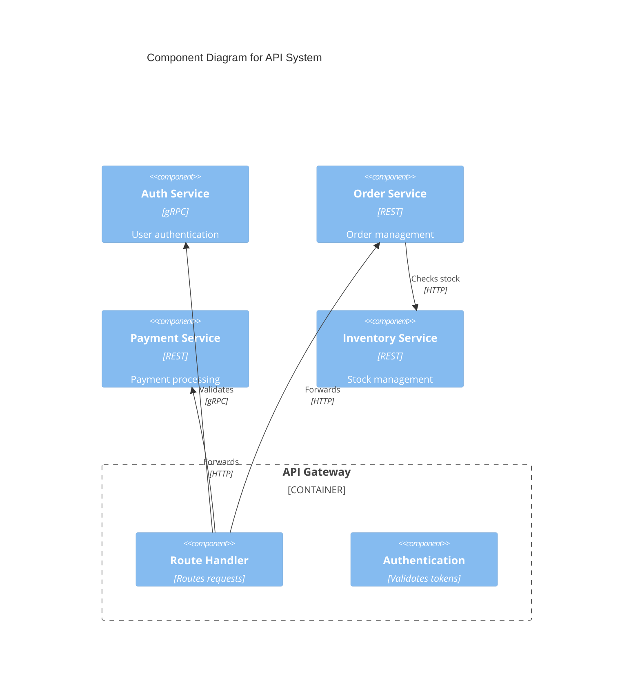

**Markdown Format:**
```markdown
## Component Diagram: [System Name]

### Components

**API Gateway**
- Responsibilities:
  - Request routing
  - Authentication/Authorization
  - Rate limiting
- Interfaces:
  - Exposes: REST API (HTTP)
  - Consumes: Auth Service, Order Service, Payment Service

**Auth Service**
- Responsibilities:
  - User authentication
  - Token generation/validation
- Interfaces:
  - Exposes: Authentication API (gRPC)
  - Consumes: User Database

**Order Service**
- Responsibilities:
  - Order management
  - Order processing workflow
- Interfaces:
  - Exposes: Order API (REST)
  - Consumes: Inventory Service, Payment Service, Database

### Dependencies
- API Gateway → Auth Service (authentication)
- API Gateway → Order Service (order operations)
- Order Service → Payment Service (payment processing)
- Order Service → Inventory Service (stock checking)
```

### 6. Use Case Diagram

**Use for:** System functionality, user interactions, feature scope

**When to extract from pseudocode:**
```
if user.isCustomer():
  can: placeOrder, viewOrders, cancelOrder
if user.isAdmin():
  can: manageProducts, viewAllOrders, generateReports
```

**Mermaid Journey or Flowchart (Use Case Alternative):**
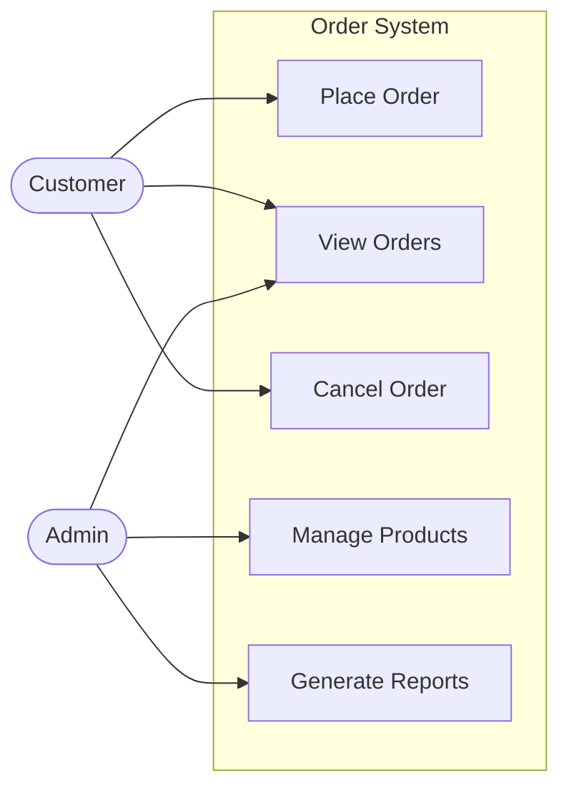

**Note:** Mermaid doesn't have a dedicated use case diagram type. Use flowcharts, user journey diagrams, or document use cases in structured markdown as shown below.

**Markdown Format:**
```markdown
## Use Case Diagram: [System Name]

### Actors
- **Customer**: End user who purchases products
- **Admin**: System administrator

### Use Cases

**Place Order** (Customer)
- Description: Customer creates new order
- Precondition: Customer logged in, items in cart
- Postcondition: Order created, inventory reserved

**View Orders** (Customer, Admin)
- Description: View order history and status
- Precondition: Authenticated user
- Postcondition: Order list displayed

**Cancel Order** (Customer)
- Description: Customer cancels pending order
- Precondition: Order exists and is cancellable
- Postcondition: Order cancelled, inventory released

**Manage Products** (Admin only)
- Description: Add, edit, or remove products
- Precondition: Admin authentication
- Postcondition: Product catalog updated

**Generate Reports** (Admin only)
- Description: Create sales and inventory reports
- Precondition: Admin authentication
- Postcondition: Report generated
```

## Diagram Creation Guidelines

### Choosing the Right Diagram

| Need to Show | Use This Diagram |
|--------------|------------------|
| Message flow between systems | Sequence Diagram (sequenceDiagram) |
| Business process flow | Flowchart (flowchart TD/LR) |
| Entity lifecycle | State Diagram (stateDiagram-v2) |
| Data structure and relationships | Class Diagram (classDiagram) |
| System architecture | C4 Component or Flowchart |
| User capabilities | Flowchart or User Journey |

### Best Practices

**Keep it Simple:**
- One diagram per concept
- Maximum 7-10 elements per diagram
- Break complex diagrams into multiple views

**Be Consistent:**
- Use standard Mermaid syntax
- Consistent naming conventions
- Same level of abstraction throughout

**Add Context:**
- Title clearly describes what is shown
- Use notes for additional context
- Brief description of diagram purpose

**Focus on Clarity:**
- Prioritize readability over completeness
- Use proper direction (TD, LR, etc.)
- Label transitions and relationships clearly

### Mermaid Diagram Syntax

All diagrams should use Mermaid format:

**Sequence Diagrams:**
````markdown
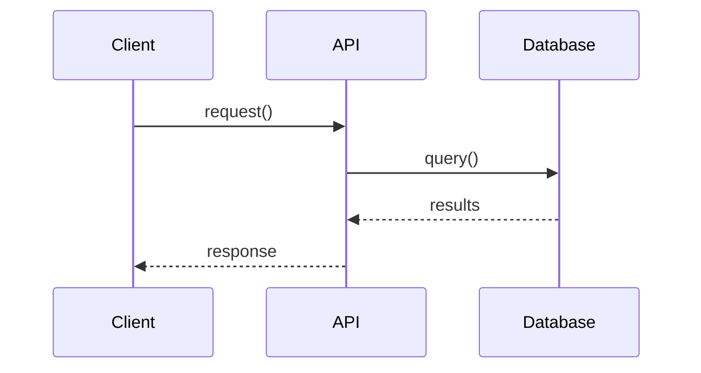
````

**Flowcharts:**
````markdown
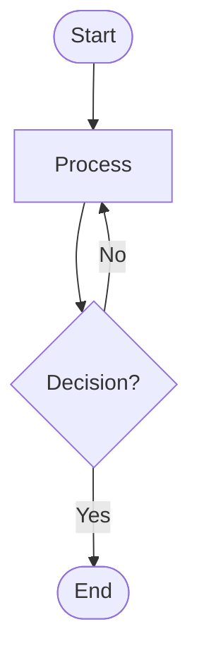
````

**State Diagrams:**
````markdown
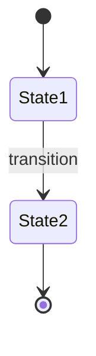
````

**Class Diagrams:**
````markdown
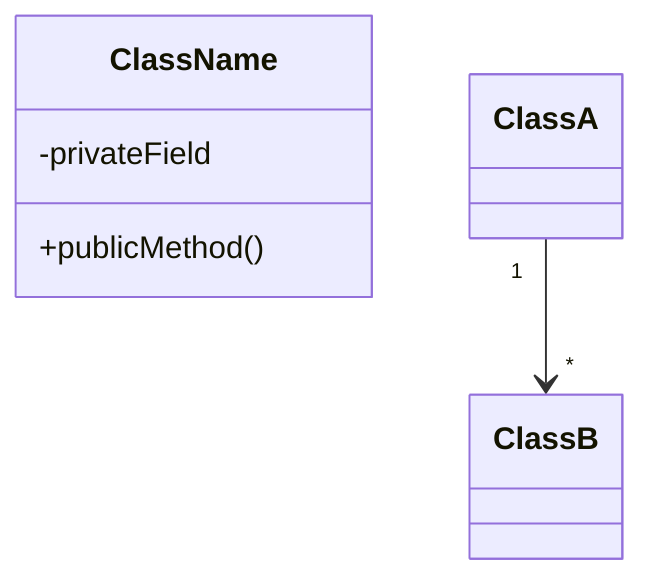
````

## Integration with Specifications

**Link Diagrams to Requirements:**
````markdown
## FR-010: Order Processing

See [Sequence Diagram: Order Processing](#sequence-diagram-order-processing)

[Detailed requirement text...]
````

**Embed in Specification Sections:**
- Overview: User Journey or Component Diagram (C4/Flowchart)
- Workflow: Flowchart or Sequence Diagram
- Data Model: Class Diagram
- State Management: State Diagram

**Traceability:**
- Reference diagram elements in requirements
- Link diagram components to FR/NFR IDs
- Version diagrams with specifications

## Why Mermaid?

**Advantages of Mermaid:**
- Native markdown integration
- Renders in GitHub, GitLab, VS Code, and many platforms
- Simple, text-based syntax
- Easy to version control and diff
- Wide tool support
- Active development and community
- Multiple diagram types in one format

**When to Use:**
- All technical documentation
- README files and wikis
- Architecture documentation
- API specifications
- Design documents
